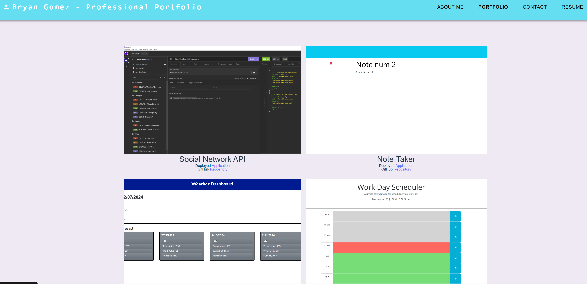

# React Portfolio
This project was created using new dependencies learned inside the bootcamp, one of them beeing **REACT**, this allows us to make a *'single page application'*, and in this way, we created a web **Professional Portfolio**, so that any recruiter can enter the URL, and find more about the candidate in question.

It shows personal information, a portfolio of projects created, it allows the user to reach and contact the candidate, and also allows to see and download a Resume in 'pdf'.

## How was this achived?
We used several dependencies, the main one beeing:
 - **REACT** for the display.
 - **formik** and **yup** to handdle the contact form.
 - **MUI Materials** as a framework.
 - **vitejs** to start the project files.

 ## How to start the project:
 The interviewer just need to follow the given URL link, and click on any of the desired navbar options to read each one of them. The interviewer can also reach the candidate by sending a mail, and also download the CV as a PDF file.

 ### Example Image:

### Project Info:
- **GitHub Repository** :
- **Running Application** :